# Components to be 3D printed

Please visit the `stl` directory to obtain these files. 

> [!NOTE] 
> Some of these STL files may need to be modified depending on the materials you purchase. For example, the motor holders and wheel bearing blocks will change depending on the thickness of the hardwood.

> [!NOTE] 
> If your ball bearings have flanges, 3D print the `wheel_bearing_block.STL` file. If they don't have flanges, print the `wheel_bearing_block_no_flange.STL` file.

Here at Stanford, a Prusa MK3.9 3D printer (Lab64) or Bambu Lab P1S (PRL AMPS) 3D printer is used. For reference, the estimated filament and time to print all of the components are provided on these 3D printers using the following printer settings:
- Filament: PLA
- Nozzle Size: 0.4 mm diameter
- Infill: 15%
- Layer Height: 0.15 mm (Prusa), 0.2 mm (Bambu)
- Supports: “everywhere”
- Brim: enabled 
- Speed: default machine settings (Prusa infill is 200 mm/s, Bambu infill is 270 mm/s)

## 3D Printed Parts List
The table below contains all the parts to be 3D printed. Components designated with a \* are components that do not depend on the specific materials purchased (i.e., doesn't depend on the motor, wheel size, wood thickness).

| File Name | Quantity per Robot | Time per Robot (Prusa MK3.9/Bambu Lab P1S) | Filament per Robot (g, estimated) | Preview |
|-----------|--------------------|------------------------------------------- | -----------------------------------|---------|
| motor_holder.STL | 2 | 1 hr 17 min/45 min | 21.56 | 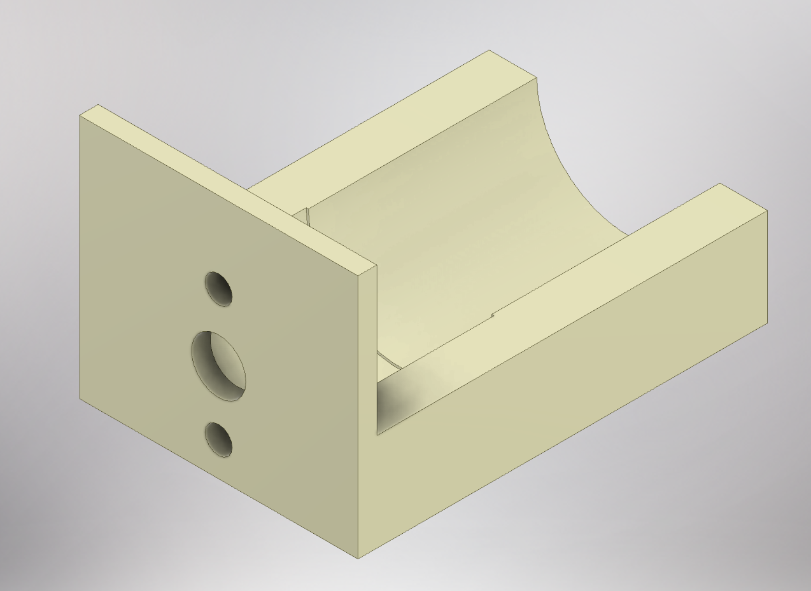 |
| wheel_bearing_block.STL OR wheel_bearing_block_no_flange.STL | 4 | 1 hr 23 min/50 min | 24.6 | 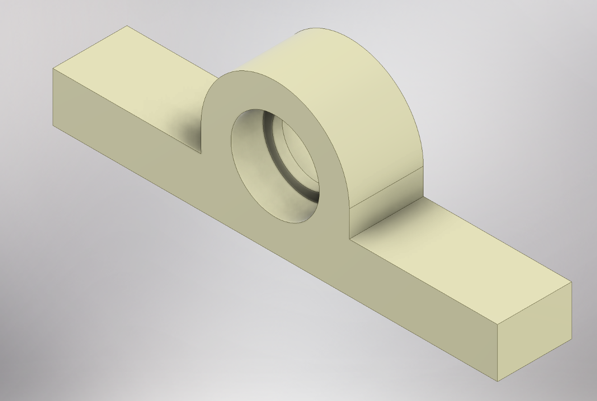 |
| * wheel_mount.STL | 4 | 27 min/23 min | 7.8 | 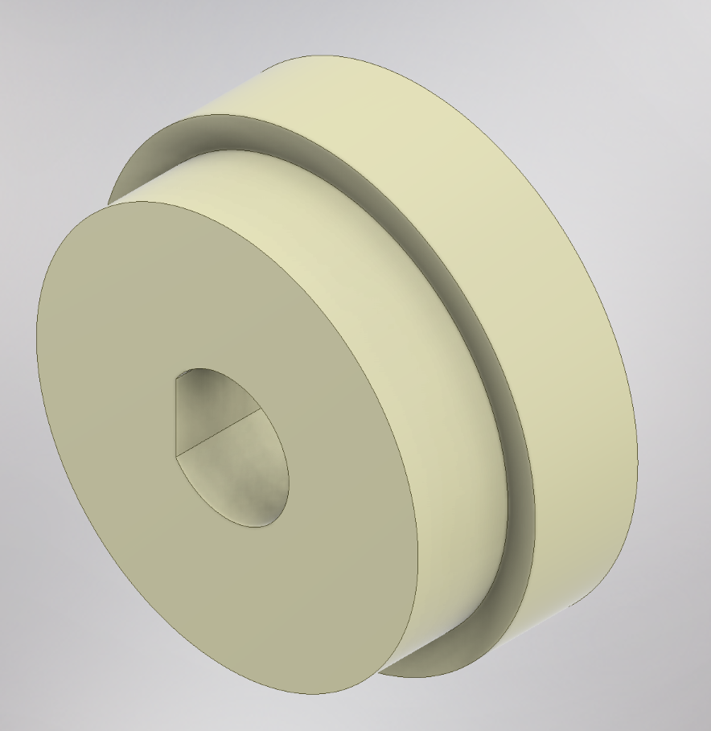 |
| * 3_in_stand_offs.STL | 8 | 1 hr 45 min/1 hr 18 min | 35.2 | 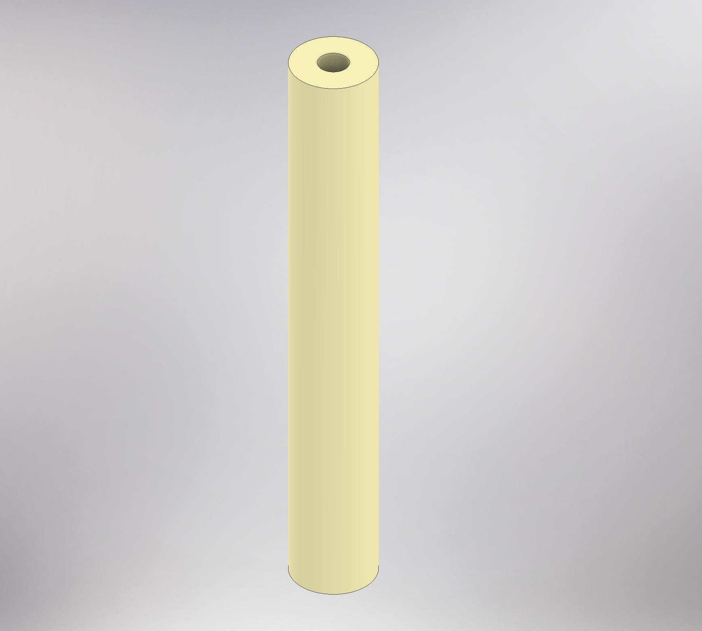 |
| * NiMH_Holder_Front.STL | 2 | 1 hr 8 min/45 min | 24.02 | 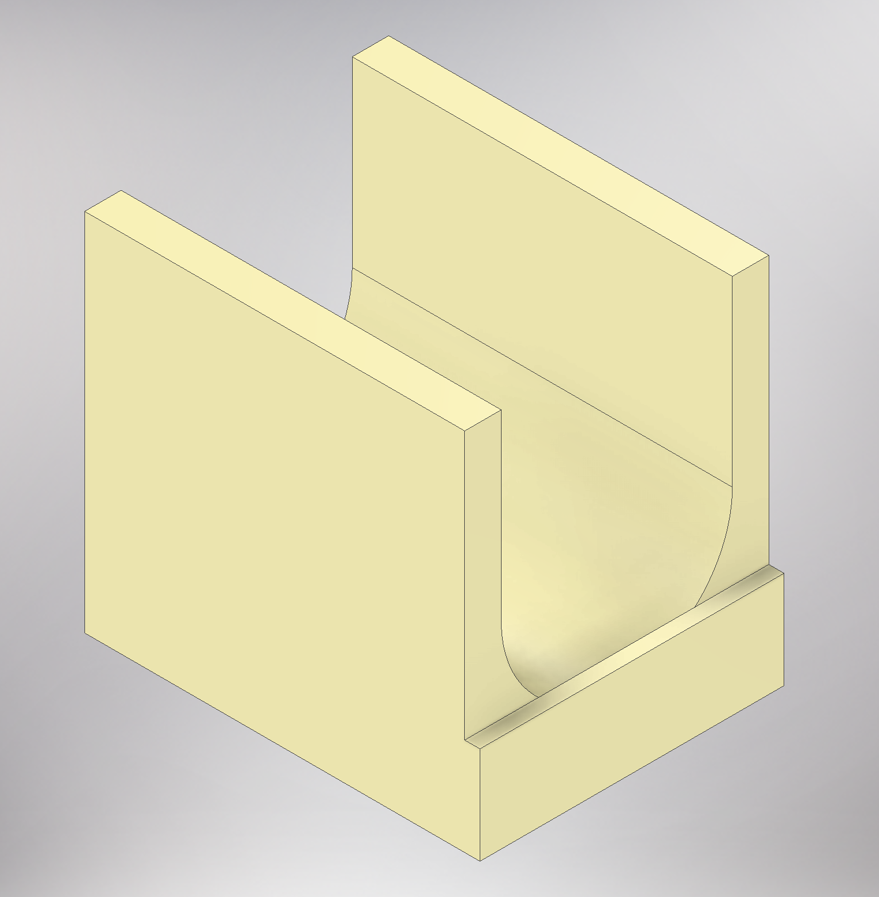 |
| * NiMH_Holder_Back.STL | 2 | 1 hr 9 min/45 min | 24.78 | 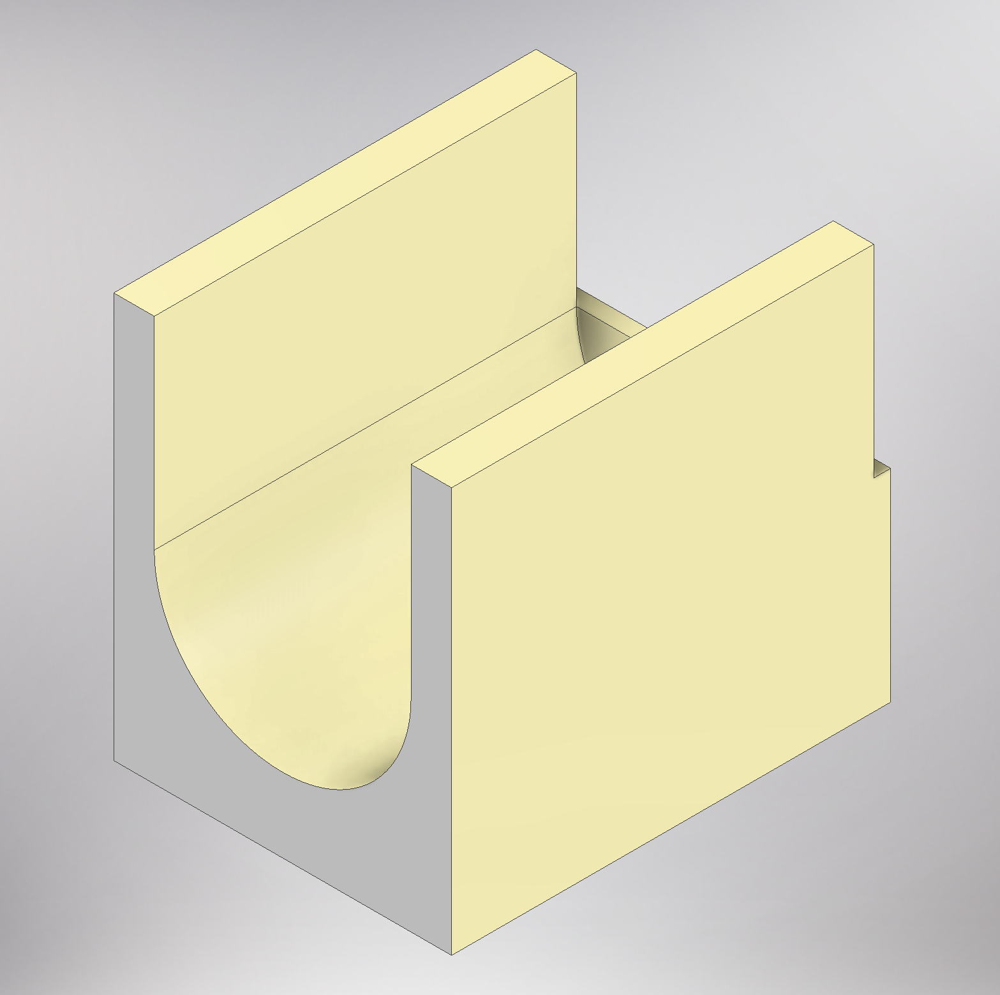 |
| * jetson_orin_nano_holder_corner_1 | 2 | 20 min/17 min | 6.5 | 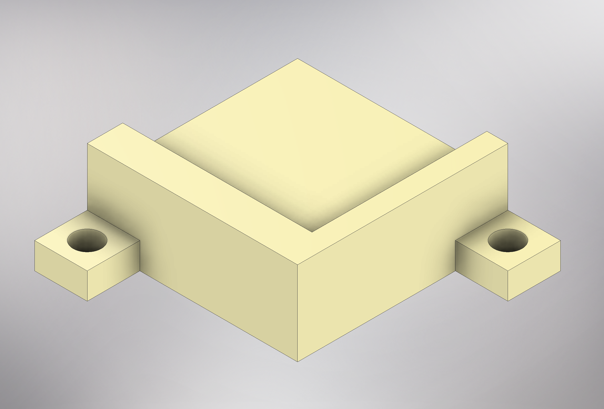 |
| * jetson_orin_nano_holder_corner_2 | 2 | 20 min/17 min | 6.5 | 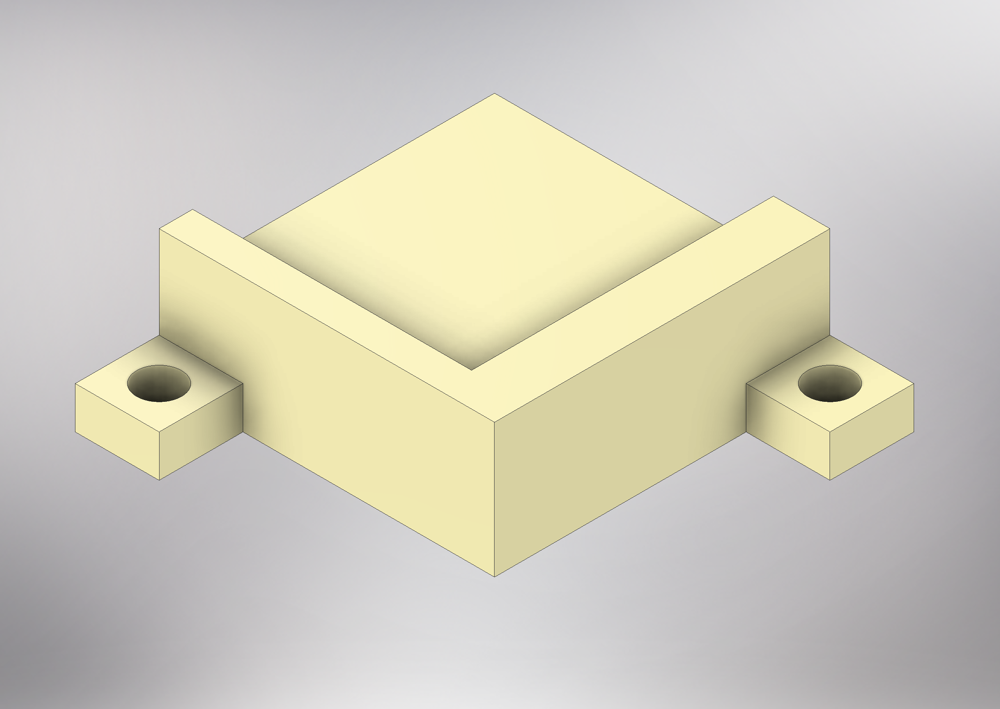 |
| * 9_inch_spacer.STL | 12 | 18 hr/15 hr | 351.36 | 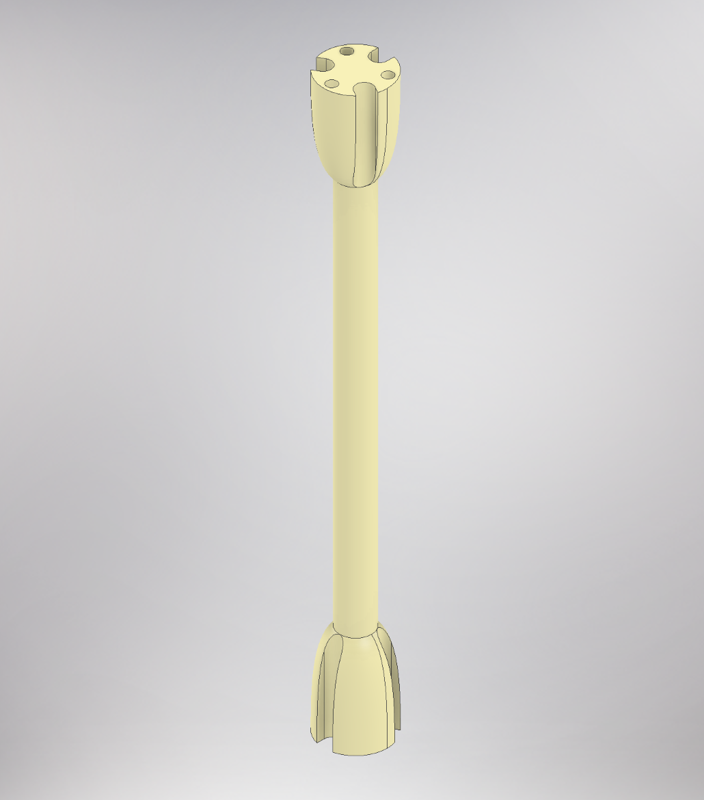 |
| astra_holder.STL | 1 | 1 hr 15 min/53 min | 25.12 | 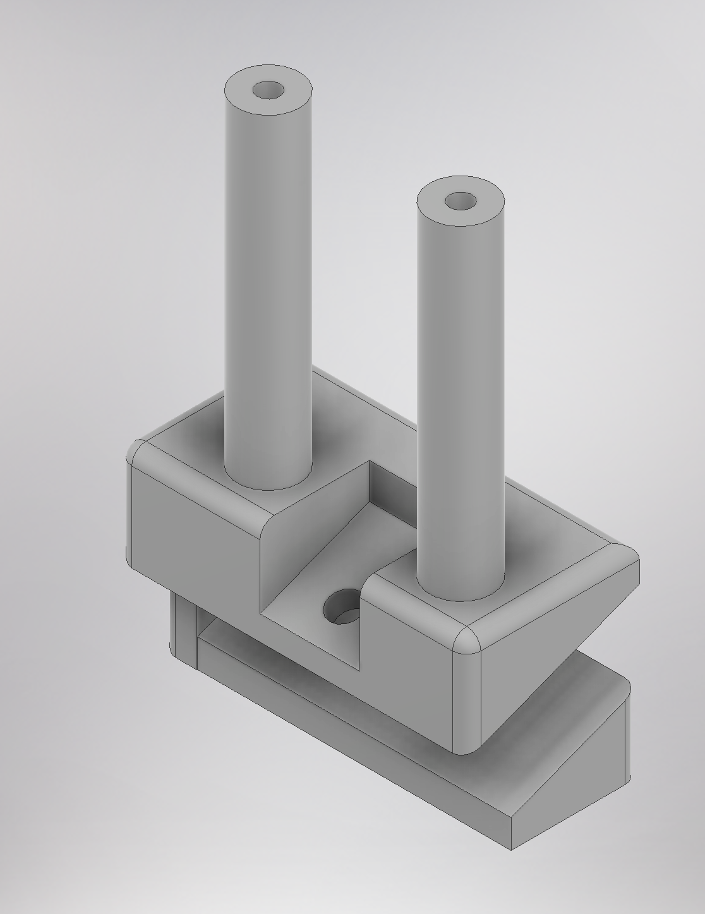 |
| * 3.5_inch_standoff.STL | 4 | 52 min/45 min | 19.84 | 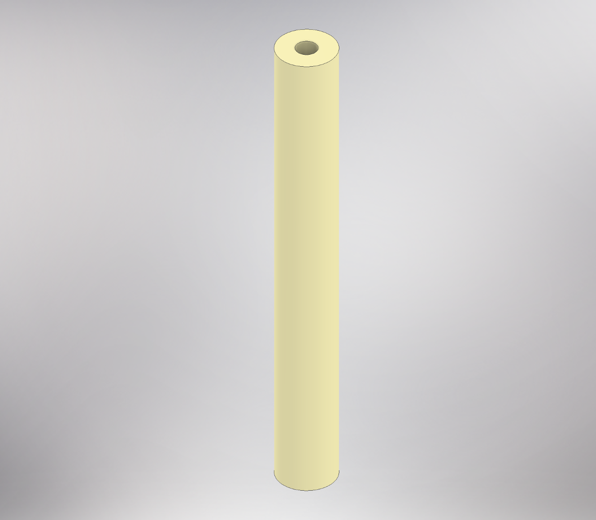 |
| display_bottom_support_left.STL | 1 | 15 min/6 min | 1.7 | 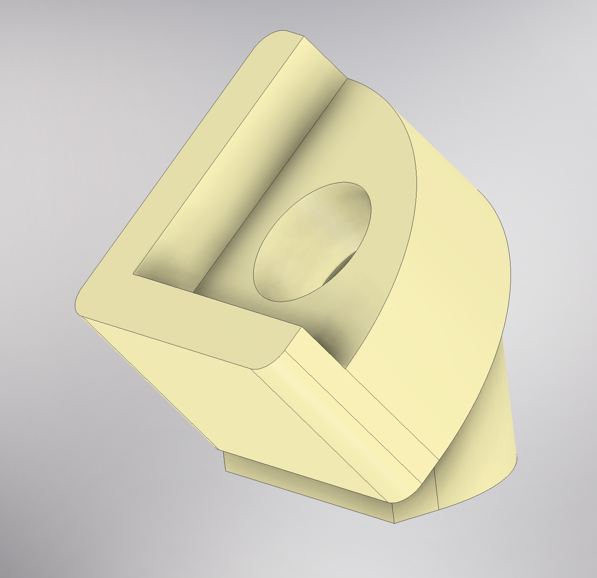 |
| display_bottom_support_right.STL | 1 | 15 min/6min | 1.7 | 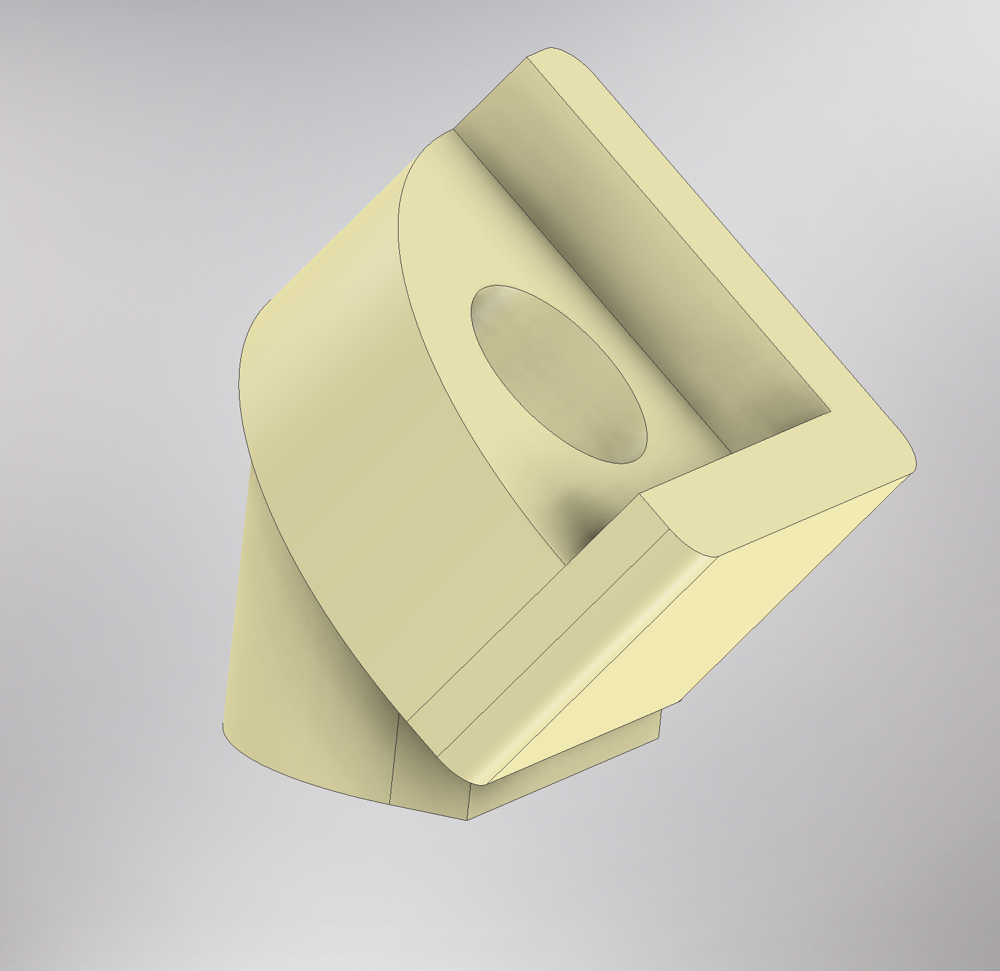 |
| display_top_support_left.STL | 1 | 23 min/18 min | 6.27 | 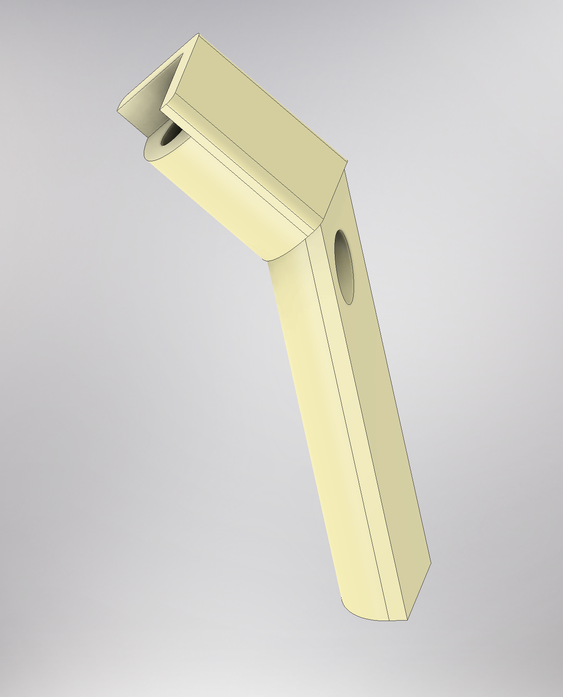 |
| display_top_support_right.STL | 1 | 23 min/18 min | 6.27 | 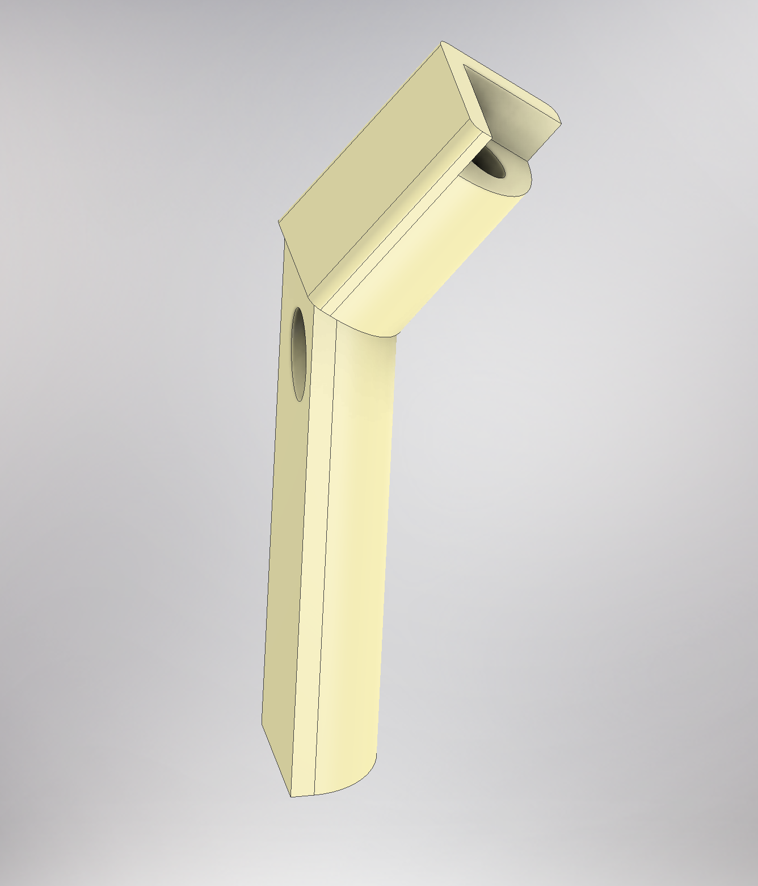 |
| microphone_casing_back.STL | 2 | 25 min/23 min | 5.42 | 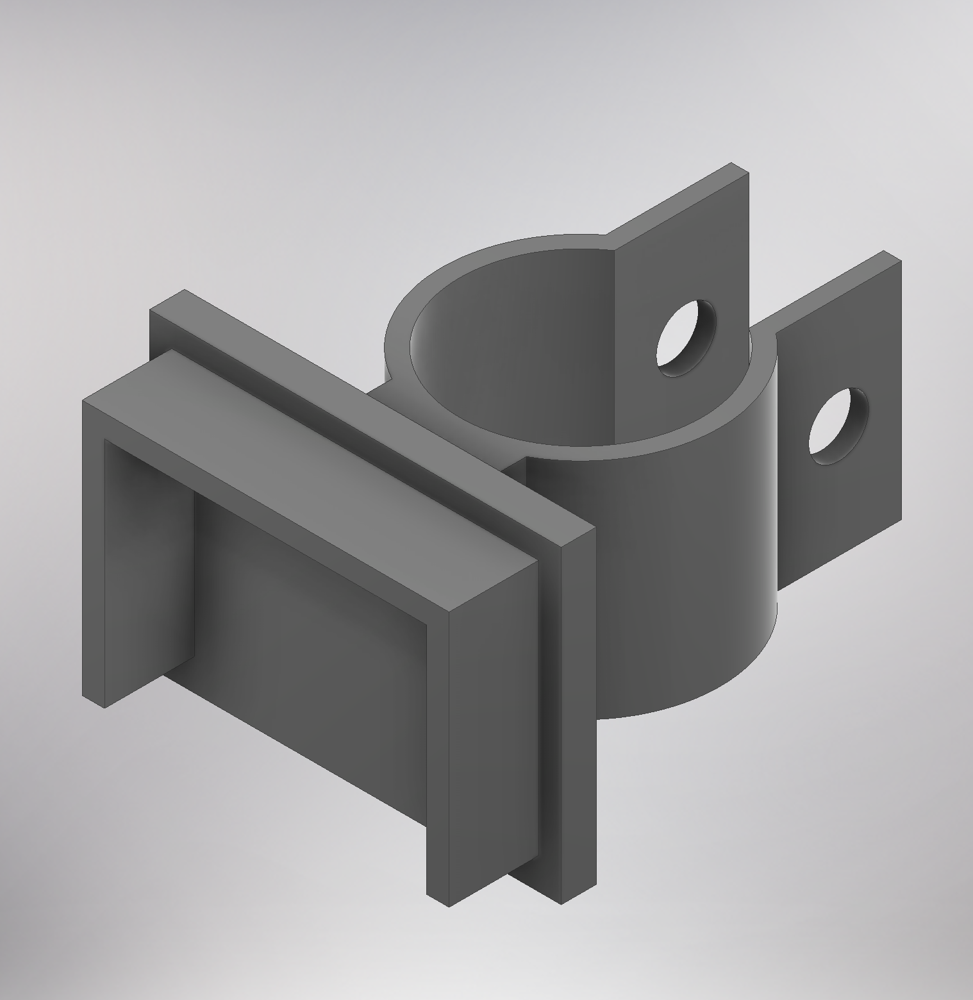 |
| microphone_casing.STL | 2 | 13 min/13 min | 2.84| 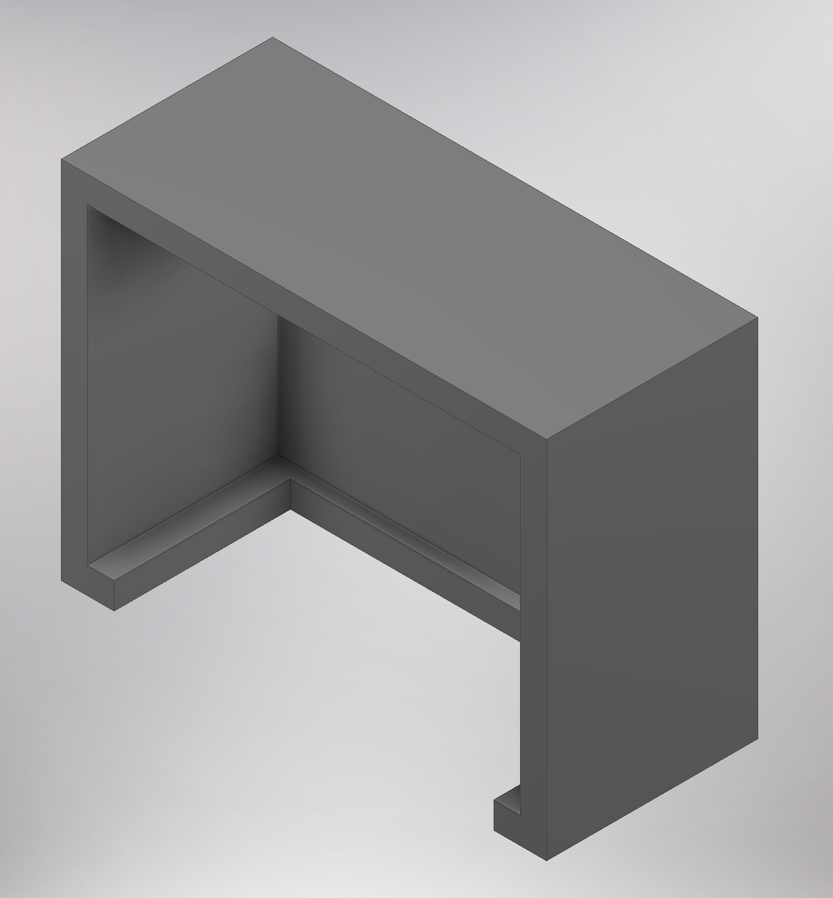 |
| **Total** | | 30 hr/23.5 hr | 571.5 |

