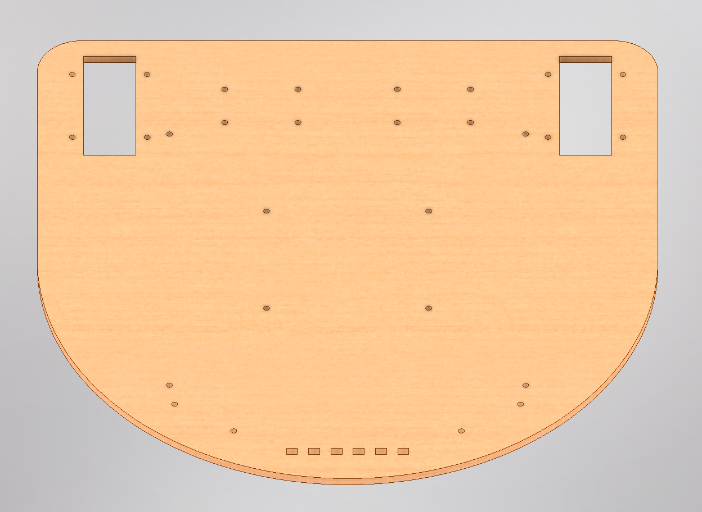
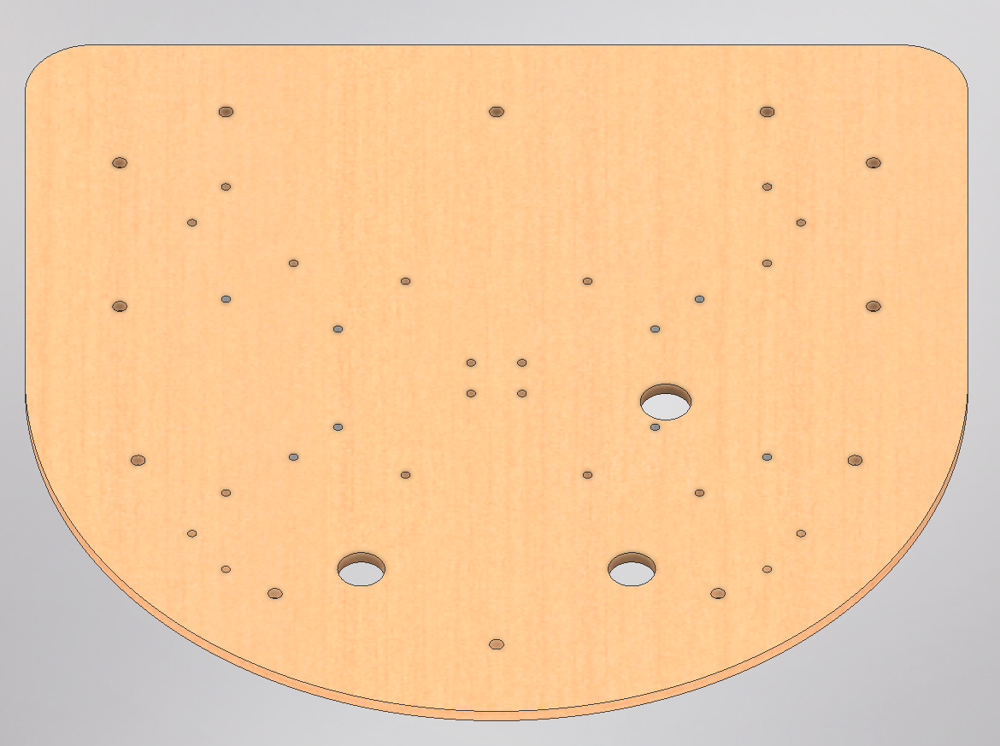
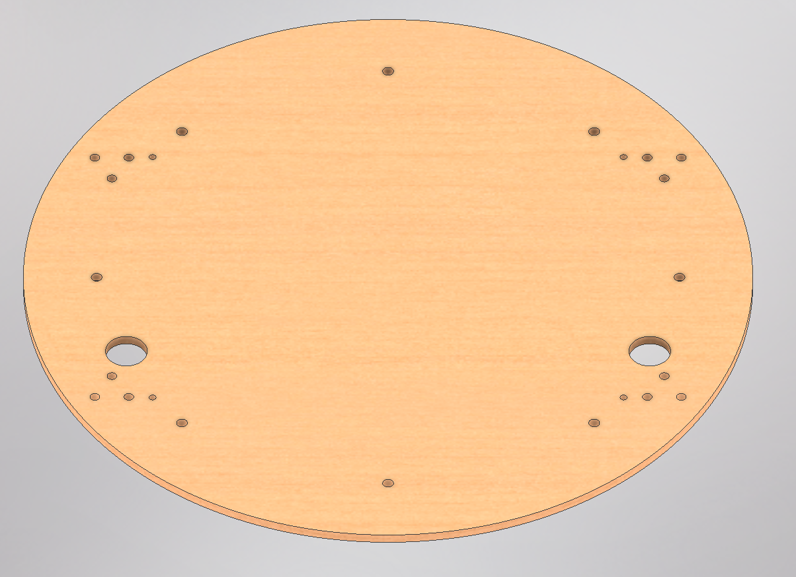
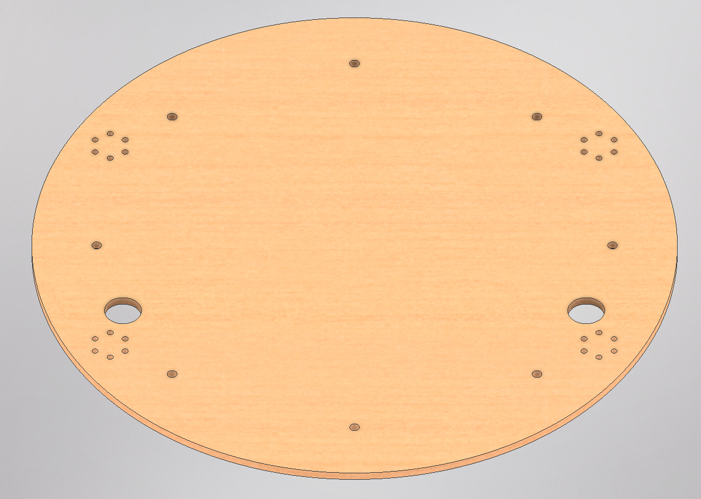
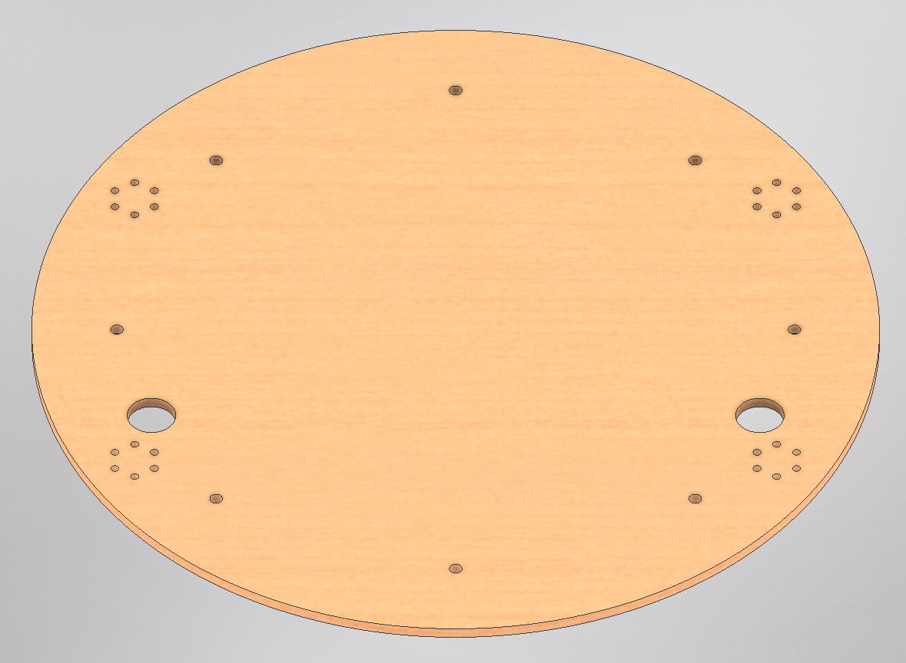
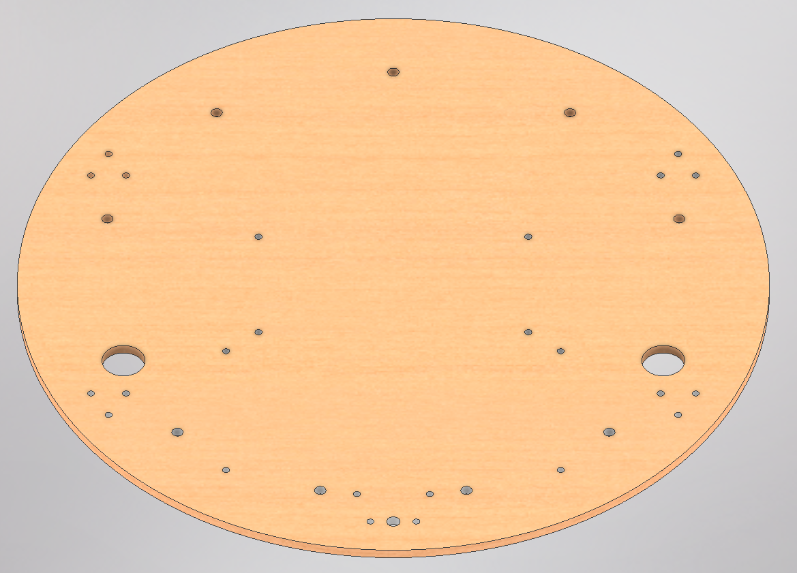
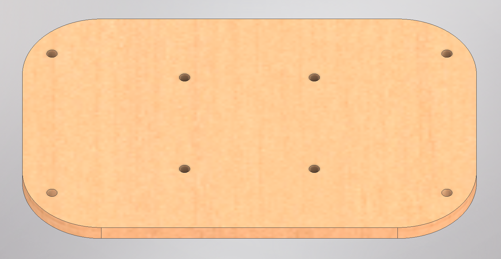
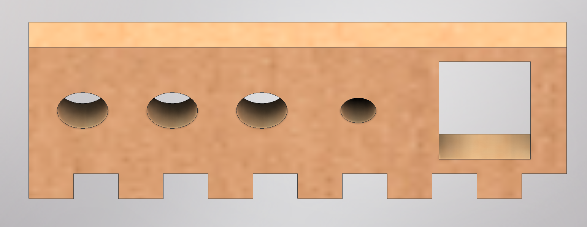

# Components to be Laser Cut

A laser cutter is used to produce the platforms of the mobile robot. Please visit the `dxf` directory to obtain these files. For full construction instructions, visit the [Mechanical README](./README.md).

> [!NOTE] 
> Some of these dxf files may need to be modified depending on your design (i.e., size/shape of robot).

Here at Stanford, a Trotec SP500 (Lab64) or Universal Laser Systems VLS 4.60 (PRL AMPS) laser cutter is used. Any laser cutter can be used, as long as the laser cutter supports the size of the parts and the materials.

## Laser Cut Parts List
The table below contains all the parts to be laser cut. 

### Materials
We use a tempered hardboard for the material, such as [this product available at Home Depot](https://www.homedepot.com/p/Hardboard-Tempered-Panel-Common-3-16-in-x-4-ft-x-8-ft-Actual-0-175-in-x-48-in-x-96-in-832780/202404545). Typically, we use between 1/8 to 1/4 inch thick sheets of material. As long as your material is able to be laser cut and is rigid enough, it can be used for thie mobile robot platforms.

### Laser Cutter Settings
Setting will vary widely between laser cutters, material, and material thickness. Perform some small test cuts to determine the optimal laser power and speed.

### Ensuring Correct Sizes
To ensure the DXF files are imported correctly into your laser cutting software, we provide some reference dimensions for the laser cut components:

- The diameter of the platforms is 354 mm (~14 inches)

### Component List
| File Name | Quantity per Robot | Preview |
|-----------|--------------------|---------|
| level1.DXF | 1 |  |
| level2.DXF | 1 |  |
| level3.DXF | 1 |  |
| level4.DXF | 1 |  |
| level5.DXF | 1 |  |
| level6.DXF | 1 |  |
| LIDAR_plate.DXF | 1 |  |
| control_panel.DXF | 1 |  |
| **Total** | 8 | |

