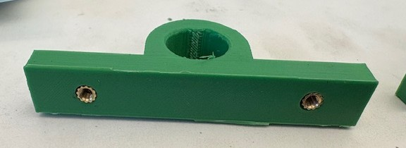

# CAD

This directory contains the CAD files for the mobile robot. The components for all parts are modeled with SolidWorks and are available in the `mechanical` zip file. First, unzip the `mechanical` zip file before proceeding.

The remainder of this README provides instructions for creating the mechanical form of the mobile robot for the approximately 1 meter tall robot:

A comprehensive parts list is located in `BOM.xlsx` that will be needed for constructing this mobile robot.

1) **Laser cut the platforms out of a thin, stiff wood.** I use tempered hardwood (Duron) of 1/8"-1/4" thickness. Every file that should be laser cut is listed in the `lasercut.xlsx` file. The corresponding `.dxf` files are located in this directory. For reference, to make sure the files are the correct size/units, the diameter of the circular platforms is 354 mm (14 inches).
2) **Prepare the 3D printed parts.** 3D Print the required parts using PLA plastic. Every file that should be 3D printed is listed in the `3d_print.xlsx` file. The corresponding `.stl` files are located in this directory. To to verify that the 3D printed parts are the correct size/units, the length of the bearing blocks should be 3 inches (76 mm).

**Note**: If you use different components (motor, wheels, etc), the laser cut or 3D printed files may need to be modified first.

3) **Insert heat set inserts.** Use a soldering iron to insert the heat set inserts into any 3D printed part that requiers heat set inserts. The small end of the heat  set insert should enter the 3D printed part first. I recommend using a low temperature (~400F or 200C). 

4) **Install the motors.** Insert the motors into the motor blocks and secure with screws. **Important**: select the proper length screw (not too long!!!) so that the screw does not go too far and break the motor.

5) **Install the bearing blocks.** Insert the ball bearings into the bearing blocks (one bearing per bearing block). They are meant to be press fit, but if they are loose then use some epoxy to secure the ball bearings.

6) **Install the wheel blocks.** These wheel blocks must be inserted in the wheel to hold the drive shaft. Use epoxy to secure the blocks into the wheel (insert a block on both sides of the wheel-2 total per wheel). Insert the shaft to ensure the blocks are aligned.

7) **Install all parts on the first platform layer.** Secure the motor, wheel, bearing blocks, shaft, and spider coupler to the first platform layer. Use M3 screws. The ball bearing should be facing the wheel.

8) **Install battery holders and Jetson holder onto the second level platform.** Use M3 screws to attach the 2 battery holders and Nvidia Jetson Holder onto the second level platform.

9) **Install standoffs on the first layer** Install the 3 inch standoffs to connect the first and second layer platform. Below they are shown as metal standoffs, but 3D printed versions can be used as well.

10) **Secure 3 Pronged standoffs to each platform** Connect the 3 pronged standoff to the top of levels 3, 4, and 5. This means you will insert 3 M3 screws through the bottom of the platform. Make sure the prongs are aligned so that when you connect the other side they are lined up with the empty holes!

***
At this point, I recommend preparing the Jetson and inserting the Jetson into it's platform. Read more instructions here in the `Electrical` directory.
***

11) **Connect the 2nd and 3rd level.** Connect the 2nd and 3rd level using the 3D printed 3 inch standoffs and M3 screws.

12) **Add Levels 4, 5, and 6.** Add these levels one by one by connecting to the 3 pronged standoffs. This is the most tedious part of the whole process as you will need to attach three M3 screws per standoff. 

13) **Attach the LiDAR to the platform and to the top level.** Screw the LiDAR sensor into the platform. **Important**: do not use too long of screws. Next, attach the LiDAR platform to the top level with the 3.5 inch standoffs. The LiDAR cable should be facing the front of the robot.

14) **Attach the Astra Camera.** Insert the Astra camera into its mount using an M6 screw. Then, attach the mount to the top level using M3 screws.

15) **Attach the touch screen.** Attach the touch screen to its legs. The long legs use a screw (provided with the screen) to attach, while the screen just rests in the short legs. Secure the legs to the top platform using M3 screws.

16) **Attach the USB camera.** Use two M3 screws to attach the camera to the top level. 

17) **Attach the microphones.** First, the microphones neede to be inserted into the housings. For best performance, use a gasket and acoustically transparent membrane. I use a piece of foam-like double sided tape for the gasket and muslin fabric for the acoustically transparent membrane. With these layers, use a M3 screw to secure the microphone/PCB to the housing. Then, glue the housing to it's back. Last, connect the entire housing to one of the three pronged standoffs using a M3 screw.

18) **Attach the foam bumpers.** Use the zipties to secure the foam bumpers to each level. You may need to cut small sections out of the foam to accomodate the three pronged standoffs. To connect the ends of the foam together, use some masking tape.

