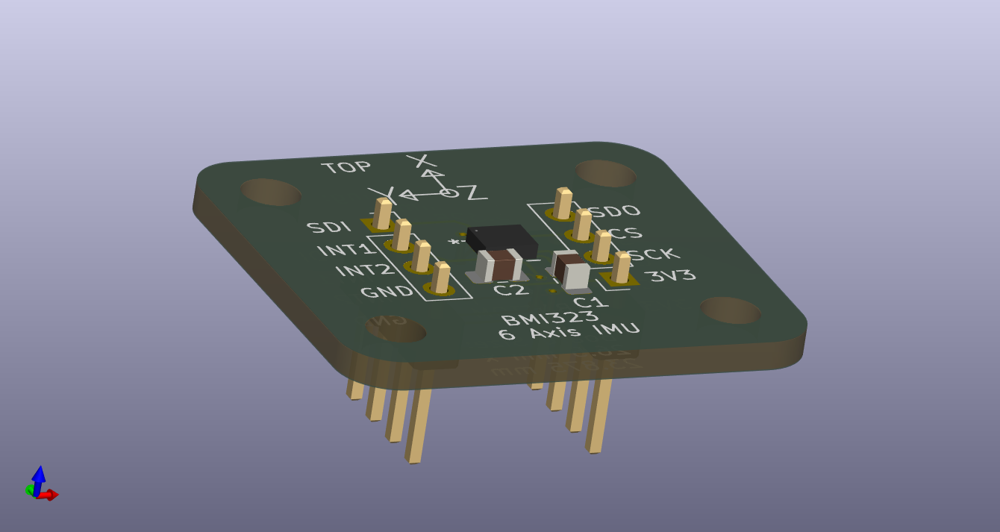
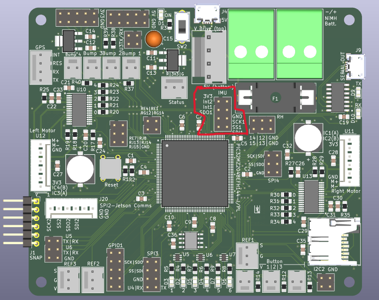

# 6-axis IMU

This directory contains the electrical schematic for a breakout board for the Bosch BMI323 6-axis IMU. This IMU provides a 16 bit digital triaxial accelerometer, a 16 bit digital triaxial gyroscope, and a 16 bit digital temperature sensor.

This breakout board is designed so that the IMU can be placed anywhere that is convenient.

## Soldering the IMU
This IMU is in a QFN package, which means the device should be reflow soldered. Alternatively, you can carefully apply solder to the PCB pads, put the IMU on top, and use a heat gun to solder the IMU.

## Pin directions
The header pins should be soldered on the bottom of the PCB:

## Installing the IMU
The assembly is meant to be installed on the robot with the IMU facing upwards. The positive X/Y/Z axes are designated on the board. The IMU should be connected via wire to the designated header on the main control board:

| IMU Breakout Pin | Main Control Board Connection |
|------------------|-------------------------------|
| 3V3              | 3.3V                          |
| GND              | GND                           |
| SCK              | SCK                           |
| CS               | CS                            |
| SDO              | SDI                           |
| SDI              | SDO                           |
| INT1             | INT1 (Currently Unused)       |
| INT2             | INT2 (Currently Unused)       |

The IMU connection on the main control board is indicated below:

