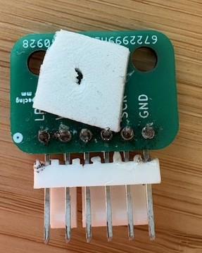
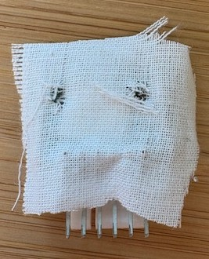
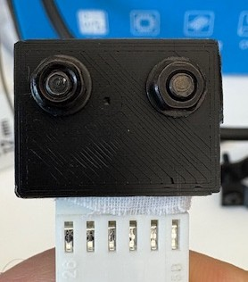
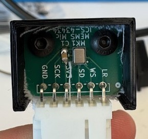
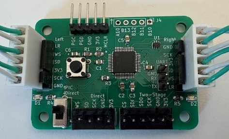

# Microphone Design

This directory holds the electrical design for the microphones. Note, you will need one  PIC32 board and two microphone boards for a single system. The two microphones allows for stereo audio. The PIC32 board is an intermediary that translates the audio signal into a format that the Jetson can read.

**Note**: Soldering the microphones is not easy. You will need solder paste and a reflow oven.  You can order a stencil for the solder paste, or manually apply the solder paste to the microphone pads (be careful not to add too much solder!).

## Putting the Microphones Together
Once you have a soldered microphone PCB, we can construct the full microphone in its housing. 3D print the housings (instructions in the [Mechanical Directory](../../CAD/README.md)). For a more robust microphone, we use a gasket and an acoustically transparent fabric to prevent debris from entering the microphone port. To construct the housing

1. Attach the gasket, making a hole slightly larger than the microphone port (be sure the hole is big enough even after the gasket is compressed). For the gasket, I use a foam-like double sided tape.

     

2. Place the acoustically transparent membrane over the gasket and PCB, cut holes for the screws. For the acoustically transparent fabric, I use Muslin (which can be picked up at your local fabric store).

    

3. Attach the PCB to the 3D printed housing using two screws.

       

4. Connect the two microphones to the PIC32 Control Board using Molex Connectors.

    

## Setting up the PIC32
Once you have a soldered PIC32, you must program it with the source code located in the [PIC32 Firmware](./PIC32%20Firmware/) directory. Connect the two microphones to the PIC32 board. Connect the PIC32 board to the Jetson's I2S pins. Then, follow the instructions at https://github.com/satomm1/mattbot_record/tree/noetic for Jetson software.

## PIC32 to Jetson I2S Pin Mapping

We will be using the 6-pin connector for this microphone (ignore the 5 pin header). Make sure the switch is switched in the upward position. Then, connect the pins on the PIC32 Board to the Jetson using the following connections (may need to adjust pin # based on your hardware):

| PIC32 Pin | Jetson I2S Pin | Jetson I2S Pin Number |
|-----------|----------------|-----------------------|
| CS        | I2S2_FS        | __ |
| SDI       | I2S2_DOUT      | __ |
| SDO       | I2S2_DIN       | __ |
| SCK       | I2S2_SCLK      | __ |
| GND       | GND            | __ |
| 3V3       | 3.3V           | __ |
