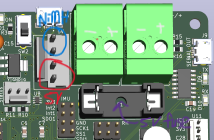
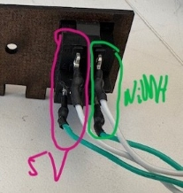
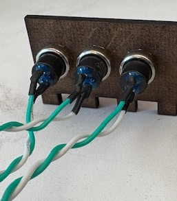

# Electrical

Contains the electrical schematics and PCB gerber files for the Robot electronics. There are several Schematics/PCB designs for a variety of uses:
- Main Board - the main motor controller and communicator with the Jetson
- Microphone - a breakout board for a Mems omnidirectional microphone
- IMU Breakout - a breakout board containing a 6-axis IMU
- Reflective Sensor - a breakout board containing a sensor for very short distance measurements

The Main Board is the only required electronics, so start here. The others (IMU, reflective, microphone) provide additional functionality should you wish to include them.

## Ordering a Manufactured PCB Board
You can use a variety of vendors to order a PCB. I have used JLPCB in the past. To order, all you need to do is submit the zipped `gerber_files` folder to the vendor.

## Main Board
The [main board](./MainBoard/) contains the PIC32 MCU, motor drivers, power supply, button sensors, Jetson communications, etc. In this directory, you will find a comprehensive schematic and PCB layout, as well as ready to use Gerber files for PCB manufacturing.

After populating the board, we need to make several connections from the board to other components of the mobile robot:

1. Connecting to the motors

    - The motors should be connected to the motor terminals via a 6 position female molex connector. Insert the wires corresponding to the markings on the PCB silkscreen.

2. Connecting to the Jetson

    - The jetson is connected via a 6 position female molex connector on the PCB, and dupont connectors on the Jetson header. Only the first five positions on the PCB need to be connected (SCK, SS, SDO, SDI, GND) and must be matched to the corresponding SPI pins on the Jetson header. For example, if using SPI1 on the jetson:

        | Jetson Pin Name       | Jetson GPIO | PCB Pin Name |
        |-----------------------|-------------|--------------|
        | SPI1_SCLK (SPI3_SCLK) | 23 (13)     | SCK          |
        | SPI1_CS0 (SPI3_CS0)   | 24 (18)     | SS           |
        | SPI1_din (SPI3_din)   | 21 (22)     | SDO          |
        | SPI1_dout (SPI3_dout) | 19 (37)     | SDI          |
        | GND                   | 25 (20)     | GND          |

3. Connecting to the power supply
    
    - Insert the Tamiya style leads for the NiMH batteries into the tall power blocks. The positive (red) and negative (black) terminals are indicated on the PCB via +/- silkscreen. 
    - Connect to the main power switch. The rocker switch should be connected to the 4 position Molex terminal near the battery terminals. Solder four wires to the rocker switch (with heat shrink tubing to protect the connection) and connect the other four ends to the corresponding female molex connector. The positions are as follows:

         

    - Insert a 5A fuse into the fuse holder.
    - Insert the micro-usb cable for the 5V battery into the port at the front of the board (the other micro-usb port is used for serial debugging)
    - Now, you can power on the PCB with the rocker switch. Alternatively, the small switch on the PCB is used to provide only 5V power supply access to the board in case you do not need to run the motors.

4. Connecting to the buttons
    
    - Solder a pair of wires to each button (with heat shrink tubing to protect the cunnection) and connect the other ends of the wire to a 2-position female molex connector.

        

## Microphone

## IMU Breakout

## Reflective Sensor