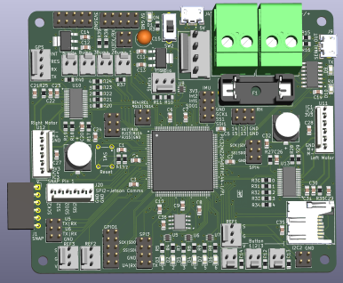

# Electrical

Contains the electrical schematics and PCB gerber files for the Robot electronics. There are several Schematics/PCB designs for a variety of uses:
- Main Board - the main motor controller and communicator with the Jetson
- Microphone - a breakout board for a Mems omnidirectional microphone
- IMU Breakout - a breakout board containing a 6-axis IMU
- Reflective Sensor - a breakout board containing a sensor for very short distance measurements

The Main Board is the only required electronics, so start here. The others (IMU, reflective, microphone) provide additional functionality should you wish to include them.

## Ordering a Manufactured PCB Board
You can use a variety of vendors to order a PCB. I have used JLPCB in the past. To order, all you need to do is submit the zipped `gerber_files` folder to the vendor.

## Main Board
The [main board](./MainBoard/) contains the PIC32 MCU, motor drivers, power supply, button sensors, Jetson communications, etc. In this directory, you will find a comprehensive schematic and PCB layout, as well as ready to use Gerber files for PCB manufacturing.

## Microphone

## IMU Breakout

## Reflective Sensor