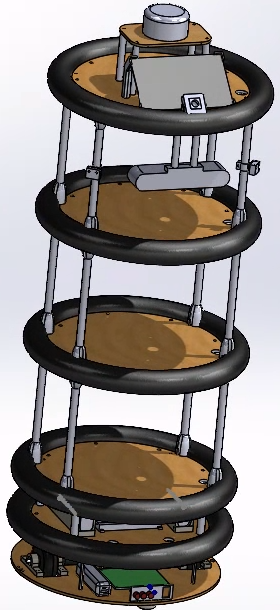
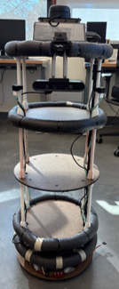

# Mobile Robot

## Authors
Matthew Sato and Kincho Law 
satomm@stanford.edu 
Stanford University Department of Civil and Environmental Engineering 
Engineering Informatics Lab

## Description
This repo contains mechanical (CAD) designs, electrical schematics, and software for creating a wheeled mobile robot.

- The mechanical design is provided in the `./CAD` directory. In this directory, you will find detailed instructions for constructing the mobile robot along with relevant STL/DXF files and a bill of materials. The CAD files were generated in Solidworks, but can be imported into Fusion as well.
- The electrical design for the motor control and sensing board is located in the `./Electrical` directory. In this directory, you will find electrical schematics and the PCB design for the motor control board. A detailed list of the components and instructions for creating the board is included. This directory also contains the schematics/PCB design for the microphones.
- The software design for the motor control board is in the `./Software` directory. This software is for the PIC32 located on the motor control board and facilitates communication between the PIC32 and Jetson, performs PID control, odometry, etc. Additionally, the software for the intermediate microphone board is included in this directory.

## License

This project is licensed under the MIT License - see the [LICENSE](LICENSE) file for details.
