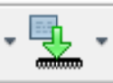

# Software

This directory containts the software for the microcontroller and instructions for setting up the Nvidia Jetson Orin Nano.

## Microcontroller Software
The microcontroller software provides the following functionality:
- PID motor control
- Odometry calculations
- Communication with the Nvidia Jetson via SPI
- Button sensing 
- Options for memory writing/reading with on board EEPROM and micro-SD
- Option to connect an IMU

To program the microcontroller, you will need to 1) download/install the MPLAB IDE from Microchip and 2) download/install the MPBLAB XC32 compiler from Microchip. You will also need a MPLAB programming device. I use the MPLAB Snap In-Circuit Debugger and Programmer, which provides the needed functionality and is affordable.

To program the PIC32, ensure the power supply is turned on and the SNAP programmer is connected. Open MPLAB and open the project located in the `./MCU` directory. Open the `FrameworkHeaders/ES_Configure.h` file and select the `ROBOT_ID`. If you are using a different PCB revision or motor type, you may need to modify `PCB_REV` and `MOTOR_TYPE`. If the motor type does not fit one of the predefined versions, you will need to modify the `Source  Files/MotorSM.c` file.

Then, program the device by pressing the 'Make and Program Device' button at the top of MPLAB:

To verify the successful programming of the PIC32, you can connect to the board via micro USB. Communicate with the PIC32 via serial port with baud rate 115200 using something such as TeraTerm.

## Setting up the Jetson
Second, this directory provides information for setting the Nvidia Jetson Orin Nano device. Included in this directory is a word document describing:
1) How to bring up the Jetson
2) How to set up the necessary Docker container on the Jetson
3) How to set up Wi-Fi on the Jetson to allow roaming

Please follow these instructions for successful setup of the Jetson device.

The ROS repos that are run on the Jetson are located in other git repos that can be found on [my GitHub profile](https://github.com/satomm1).